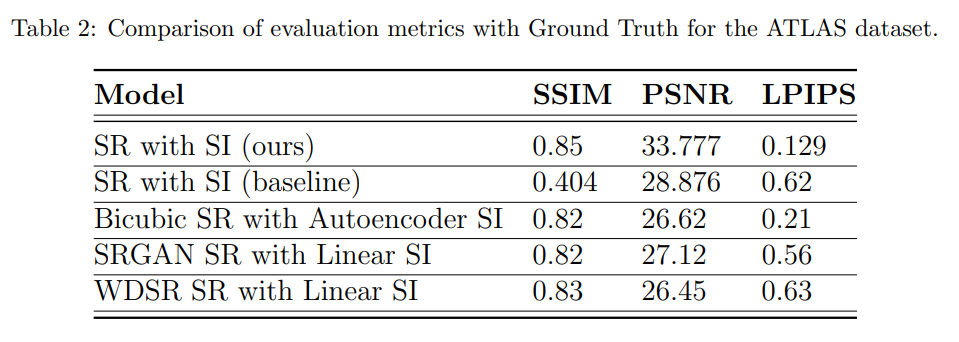

# Latent diffusion for arbitrary zoom MRI super resolution

**[Expert Systems with Applications 2025]** **[[paper](https://doi.org/10.1016/j.eswa.2025.127970)]**

## Proposed Architecture
<p align="center">

</p>

## Experiment framework


## Main results

Quantitative analysis for the ATLAS dataset:



Qualitative analysis for the ATLAS dataset:


Sample for the BRATS dataset:


## Use the model

*Inference*

```
python inference.py --input_size -n <number of interpolated slices> --ddim_eta --ddim_steps --config_path --ckpt_path --input_mri_path --edsr_path
```

*Train*

```
python main.py --base <config of the model> -t --name <name of the trained model> --train --scale_lr True
```

**Important**: An example of the configs of the model can be found at models/ldm/bsr_sr/config_original.yaml. Similarly, an example of the Dataset used for the model can be found at ldm/data/datasetsr.py


## Download the datasets

The datasets used in this work are available at:

    
- ATLAS: https://fcon_1000-projects-nitrc-org.translate.goog/indi/retro/atlas.html?_x_tr_sl=en&_x_tr_tl=es&_x_tr_hl=es-419&_x_tr_pto=sc

- OASIS: https://www.oasis-brains.org/

- OpenNeuro: https://openneuro.org/datasets/ds004199/versions/1.0.5

- BRATS: https://www.cancerimagingarchive.net/analysis-result/rsna-asnr-miccai-brats-2021/

## Acknowledgments

This work is partially supported by the Autonomous Government of Andalusia (Spain) under project UMA20-FEDERJA-108, project name Detection, characterization and prognosis value of the non-obstructive coronary disease with deep learning, and also by the Ministry of Science and Innovation of Spain, grant number PID2022-136764OA-I00, project name Automated Detection of Non Lesional Focal Epilepsy by Probabilistic Diffusion Deep Neural Models. It includes funds from the European Regional Development Fund (ERDF). It is also partially supported by the University of Málaga (Spain) under grants B1-2021\_20, project name Detection of coronary stenosis using deep learning applied to coronary angiography; B4-2022, project name Intelligent Clinical Decision Support System for Non-Obstructive Coronary Artery Disease in Coronarographies; B1-2022\_14, project name Detección de trayectorias anómalas de vehículos en cámaras de tráfico; and, by the Fundación Unicaja under project PUNI-003\_2023, project name Intelligent System to Help the Clinical Diagnosis of Non-Obstructive Coronary Artery Disease in Coronary Angiography. The authors thankfully acknowledge the computer resources, technical expertise and assistance provided by the SCBI (Supercomputing and Bioinformatics) center of the University of Málaga. They also gratefully acknowledge the support of NVIDIA Corporation with the donation of an RTX A6000 GPU with 48Gb. The authors also thankfully acknowledge the grant of the Universidad de Málaga and the Instituto de Investigación Biomédica de Málaga y Plataforma en Nanomedicina-IBIMA Plataforma BIONAND.
